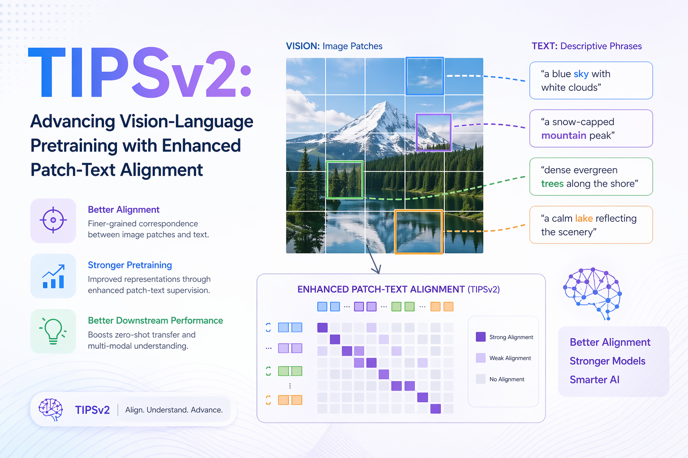

# TIPSv2: Advancing Vision-Language Pretraining with Enhanced Patch-Text Alignment



## Introduction and Motivation

Vision-language models (VLMs) have become a cornerstone of modern computer vision and multimodal AI. Systems like CLIP, SigLIP, ALIGN, and their descendants have demonstrated remarkable capability at associating images with textual descriptions, enabling zero-shot classification, cross-modal retrieval, and a growing ecosystem of downstream multimodal tasks. However, despite their strong global image-text alignment abilities, these models share a common and often underappreciated weakness: **they fail to align individual image patches with the corresponding textual concepts**.

This limitation is not merely academic. In applications such as semantic segmentation, object detection, depth estimation, visual question answering, and referring expression comprehension, the model must understand *where* in an image a concept lives, not merely *whether* a concept is present. A model that can recognize "a dog" in a scene but cannot precisely localize the dog's spatial extent in the feature space is fundamentally limited for such dense understanding tasks.

**TIPSv2** — short for the second generation of *Text-Image Pretraining with Spatial Awareness* — is a foundational vision-language model family developed by Google DeepMind that directly and systematically addresses this challenge. Accepted at CVPR 2026, TIPSv2 introduces three carefully designed innovations — **iBOT++**, **Head-only EMA**, and **Multi-Granularity Captions** — that together yield dramatic improvements in dense patch-text alignment without sacrificing global representation quality. The result is a model family that achieves state-of-the-art performance across a remarkably broad suite of tasks, including zero-shot semantic segmentation, monocular depth estimation, image-text retrieval, and standard image classification.

What makes TIPSv2 particularly compelling is that its central innovations were not conceived in a vacuum. They arose from a counter-intuitive empirical observation uncovered during controlled experiments with knowledge distillation — a finding that then inspired the core design of the pretraining objective.

::: {.callout-note}
**Accepted at CVPR 2026** | arXiv: [2604.12012](https://arxiv.org/abs/2604.12012) | Project Page: [gdm-tipsv2.github.io](https://gdm-tipsv2.github.io/) | Code: [google-deepmind/tips](https://github.com/google-deepmind/tips)
:::

---

## Background: The TIPS Lineage

To appreciate TIPSv2 fully, it is essential to understand its predecessor, **TIPS (Text-Image Pretraining with Spatial Awareness)**, which was published at **ICLR 2025**.

### What TIPS (v1) Did

The original TIPS model identified a fundamental problem with standard contrastive vision-language pretraining: models trained with objectives like CLIP's InfoNCE loss operate at the level of global image embeddings, aggregating all spatial information into a single vector. While this is excellent for global classification and retrieval, the resulting patch-level features are not aligned with text in any explicit way — they tend to be entangled and spatially incoherent.

TIPS addressed this in two main ways:

**Synthetic Caption Replacement.** Rather than training on raw, noisy web-scraped image-caption pairs, TIPS replaced these captions with synthetically generated textual descriptions produced by capable captioning models. These synthetic captions are semantically richer, more spatially descriptive, and significantly less noisy than typical alt-text from the web.

**Combining Contrastive and Masked Image Modeling.** TIPS combined CLIP-style contrastive learning (for global image-text alignment) with masked image modeling (MIM) in the style of iBOT (Image BERT Pre-Training with Online Tokenizer). The MIM component encourages the model to develop spatially coherent patch representations, since it must reconstruct masked patches from the remaining visible context.

Together, these two ideas yielded a model validated on a comprehensive suite of 9 tasks and 20 datasets, displaying strong performance that matched or exceeded other recent vision encoders — particularly on dense spatial understanding tasks.

### What TIPSv2 Builds Upon

TIPSv2 inherits the foundational ideas of TIPS but goes significantly further. Rather than simply scaling up or tuning existing components, the TIPSv2 team performed careful analysis that led to three orthogonal, complementary innovations. Each innovation is principled and theoretically motivated, and the ablations demonstrate that each contributes meaningfully to the final performance.

---

## The Core Problem: Dense Patch-Text Misalignment

### Understanding Patch-Level Representations

In Vision Transformer (ViT) based architectures, an image is divided into a grid of non-overlapping patches (e.g., 14×14 pixel patches, giving 256 patch tokens for a 224×224 image at ViT-B/14 resolution). These patch tokens, along with a `[CLS]` token representing the global image embedding, are processed by self-attention layers to produce final representations.

In a globally-trained model like CLIP, the `[CLS]` token embedding is explicitly trained to align with text embeddings via contrastive loss. The individual patch tokens, however, receive no direct text supervision.

### Why This Matters in Practice

The consequence of patch-text misalignment is measurable. When one visualizes the feature similarity maps of CLIP patch tokens with respect to text queries, the resulting maps tend to be diffuse and spatially incoherent.

This directly limits performance on:

- **Semantic segmentation** — requires associating region-level features with class names
- **Object detection** — requires localizing objects within a spatial grid
- **Depth estimation** — requires per-pixel feature quality and coherence
- **Open-vocabulary dense prediction** — requires generalizable patch-level semantics

### Prior Approaches and Their Limits

Several prior works have attempted to improve spatial understanding in vision-language models:

- **DINOv2** introduced self-supervised pretraining with excellent spatial features but lacks text alignment, limiting its utility for language-grounded tasks.
- **SILC** and related works combine self-supervised and image-text objectives but with limited patch-level text supervision.
- **RegionCLIP, CLIPSelf, MaskCLIP** propose post-hoc or fine-tuning-based approaches to improve patch-level features, but do not address the fundamental gap at pretraining.

TIPSv2's contribution is to solve this problem **directly during pretraining**, in a principled way that is computationally tractable and scalable.

---

## A Surprising Discovery: The Distillation Phenomenon

### The Observation

A central motivation for TIPSv2's design choices is an unexpected empirical discovery made during exploratory experiments with knowledge distillation. The TIPSv2 authors trained student models to distill representations from a large teacher model (ViT-g) at the **patch level** — the student was trained to reproduce the teacher's patch token representations, not just the global `[CLS]` embedding.

The result was striking: **the patch-level text alignment of the distilled student model substantially surpassed that of the teacher model**.

This is a counter-intuitive finding. Naively, one would expect distillation to produce a student that approximates but does not exceed the teacher. Yet patch-level distillation acted as a powerful regularizer that forced the student to develop more semantically coherent, text-aligned patch representations than the teacher ever had.

### Why Does This Happen?

The authors' interpretation is that patch-level distillation imposes a strong constraint: the student must make every patch token predictive and consistent. The distillation loss penalizes any patch token that is not representationally coherent with the corresponding patch in the teacher's embedding space. Combined with the text supervision inherited from the teacher, this pushes the student's patch representations toward semantic clusters that correspond to recognizable visual concepts.

In essence, patch-level distillation acts like a **spatial regularizer** that promotes the emergence of text-aligned, spatially coherent patch features.

### The Design Insight

This discovery raised an obvious and actionable question: if patch-level distillation produces better patch-text alignment than the teacher itself, can we design a pretraining objective that mimics this effect **without** requiring a separate distillation stage?

The answer is **yes**, and this insight is the genesis of **iBOT++**, TIPSv2's first and most impactful innovation.

---

## TIPSv2 Architecture and Model Family

### Vision Transformer Backbone

TIPSv2 uses the Vision Transformer (ViT) architecture as its image encoder across all model sizes:

| Model | Description |
|-------|-------------|
| **ViT-B/14** | Base-sized model with 14×14 patch size (`tipsv2-b14`) |
| **ViT-L/14** | Large-sized model with 14×14 patch size |
| **ViT-g/14** | Giant-sized model, the largest and highest-performing variant |
| **SO-400m** | Sigmoid Loss–optimized 400M parameter variant |

### Training Hierarchy

The model family is trained in two stages:

**Stage 1: Direct Pretraining of ViT-g.** The giant model is pretrained from scratch using the full TIPSv2 objective (iBOT++, Head-only EMA, and Multi-Granularity Captions). This serves as the base teacher model.

**Stage 2: Patch-Level Distillation for Smaller Models.** The ViT-B, ViT-L, and SO-400m models are trained via patch-level knowledge distillation from the ViT-g teacher — deliberately exploiting the alignment improvement originally discovered.

### Text Encoder and Projection Heads

TIPSv2 employs a text encoder trained alongside the image encoder using contrastive objectives. Both image and text encoders attach lightweight MLP projection heads that map representations to the shared embedding space. The design of these projection heads is central to the Head-only EMA strategy.

---

## Key Innovation 1 — iBOT++: Extending the Self-Supervised Loss

### Background: iBOT and Masked Image Modeling

iBOT (Image BERT Pre-Training with Online Tokenizer) is a self-supervised pretraining technique for ViTs that combines masked image modeling with online tokenization. In standard iBOT:

1. A random subset of patches is **masked** (replaced with a learnable mask token).
2. The model is trained to predict the representations of masked patches, using a momentum-updated teacher as the target.
3. The `[CLS]` token is aligned across two augmented views via a self-supervised classification loss (DINO-style).

The key signal comes **exclusively from masked patches** — visible patches do not directly contribute to the MIM loss.

### The Limitation of Masking-Only Supervision

This masking-only paradigm has an implicit inefficiency: at any given training step, the majority of patches (those not masked) are not contributing to the patch-level self-supervised objective. Given the distillation discovery, this is a missed opportunity — enforcing patch-level representation consistency even for visible patches dramatically improves patch-text alignment.

### iBOT++: All Tokens Contribute

::: {.callout-important}
**iBOT++** extends the patch-level self-supervised loss to **ALL patch tokens** — both masked and unmasked — rather than only to masked patches.
:::

At each training step, the iBOT++ loss computes a representation consistency target for every patch in the image, using the momentum teacher as the target generator. This means even visible patches must align with the teacher's patch embeddings.

This change:

- Forces semantically coherent, consistent patch representations across all spatial locations
- Propagates dense patch-level gradients at every step
- Mimics the effect of patch-level distillation within the pretraining loop
- Produces dramatically smoother, more spatially coherent feature maps

### Quantitative Impact of iBOT++

::: {.callout-tip}
The addition of iBOT++ improved zero-shot semantic segmentation performance by **+14.1 mIoU** — a large gain by any standard.
:::

Qualitative visualizations confirm this: iBOT++ models produce attention maps and PCA-based feature visualizations that clearly delineate object boundaries, textures, and semantic regions far more distinctly than standard iBOT-trained counterparts.

### Why This Works: Connecting to the Distillation Insight

The connection to the distillation discovery is direct. In distillation, all patch positions receive a loss signal. iBOT++ replicates this regime by applying the MIM-style loss to all positions. The momentum teacher plays the role of the large pre-trained teacher in the distillation setup, while teacher and student evolve jointly during pretraining via EMA updates.

---

## Key Innovation 2 — Head-Only EMA: Efficient Teacher-Student Training

### The Standard EMA Teacher in Self-Supervised Learning

In methods like DINO and iBOT, the teacher network is maintained as an exponential moving average (EMA) of the student's parameters:

$$\theta_t \leftarrow \lambda \cdot \theta_t + (1 - \lambda) \cdot \theta_s$$

where $\lambda$ is a momentum coefficient (typically $\approx 0.999$).

This results in a stable teacher that provides high-quality targets. **However**, maintaining a full teacher network doubles the memory footprint and significantly increases training time.

### The Head-Only EMA Strategy

TIPSv2 introduces a more efficient variant: **Head-only EMA**. The key enabling observation is that TIPSv2 has **text supervision**, which fundamentally changes training dynamics compared to purely self-supervised approaches.

With text supervision, the contrastive image-text alignment loss provides a powerful anchor that prevents collapse — even without a full-backbone EMA. The language signal enforces that representations must remain semantically meaningful and discriminative.

::: {.callout-important}
In **Head-only EMA**, the EMA update is applied only to the **projection heads** (lightweight MLP heads), while the teacher encoder is set equal to the student encoder at each step.
:::

In effect:
- The teacher backbone **is** the student backbone (no separate copy needed for the encoder)
- Only the much smaller projection heads maintain EMA-updated parameters

### Benefits of Head-Only EMA

| Benefit | Details |
|---------|---------|
| **Memory Efficiency** | Eliminates the EMA teacher backbone copy; saves tens of GB of GPU memory for ViT-g models |
| **Training Throughput** | ~**42% reduction in trainable parameters** during training; meaningfully improved throughput |
| **Performance Retention** | Performance is comparable to full EMA, demonstrating that text supervision prevents collapse |

### Connection to Distillation

Head-only EMA is also conceptually motivated by the distillation setting: in patch-level distillation, the teacher encoder is completely fixed. Head-only EMA approximates this in spirit — encoder-level EMA is eliminated, and only the projection heads maintain temporal momentum smoothing.

---

## Key Innovation 3 — Multi-Granularity Captions: Richer Text Supervision

### The Problem with Standard Image-Text Pairs

Most large-scale VLMs are trained on web-sourced captions that are short, noisy alt-text strings describing only the most salient element (e.g., "a cat") without spatial or relational detail. The original TIPS model already demonstrated that **synthetic captions** significantly improve representation quality.

TIPSv2 takes this further with a multi-granularity approach.

### Three Levels of Textual Granularity

During TIPSv2 pretraining, each image is paired with captions at three distinct granularity levels:

**Short captions (web-scale).**
Brief, general descriptions of overall image content. Provide coarse global semantic signal and help the model learn broad visual-semantic associations.

**Medium-length detailed captions (PaliGemma-generated).**
Descriptions generated by PaliGemma naming more objects, describing attributes (color, shape, texture, size), and capturing spatial relationships. Provide a richer intermediate-level signal.

**Long, comprehensive captions (Gemini-generated).**
Highly detailed, multi-sentence descriptions covering fine-grained attributes, scene context, inter-object relationships, spatial layout, and subtle semantic details. The richest and most informative level.

### Caption Sampling Strategy

A key design choice is the **random sampling strategy**: during training, for each image, the model randomly samples from the available caption granularities. This introduces diversity, prevents overfitting to any single caption style, and teaches the model to be robust to varying levels of textual specificity.

### Why Multi-Granularity Captions Improve Patch-Text Alignment

When a long, detailed caption describes *"a red fire hydrant near the curb, partially obscured by autumn leaves, with a yellow parking sign to its left,"* the model must develop image representations that encode these spatial and attribute details to align with the caption. This directly pushes patch representations toward being semantically informative about their local visual content.

---

## Pretraining Objectives: Putting It All Together

TIPSv2's pretraining combines multiple objectives into a single training loss.

### Contrastive Image-Text Alignment Loss

The foundational objective is a **CLIP-style contrastive loss** (or SigLIP-style sigmoid loss for the SO-400m variant) between global image embeddings and text embeddings:

- The image encoder produces a `[CLS]` token embedding for each image.
- The text encoder produces an embedding for each caption.
- A cross-modal contrastive loss (InfoNCE or sigmoid binary cross-entropy) aligns matched pairs and pushes apart mismatched pairs.

### iBOT++ Self-Supervised Loss

The iBOT++ patch-level loss operates alongside the contrastive loss:

1. Two augmented views of each image are passed through the student encoder.
2. A momentum-updated teacher (with head-only EMA on projection heads) produces target representations.
3. For **every** patch token in both views, a distribution prediction loss is computed.
4. A `[CLS]`-level self-supervised classification loss (DINO-style) is also applied.

### Combined Loss Function

The final training loss is a weighted combination:

$$\mathcal{L}_{\text{total}} = \alpha \cdot \mathcal{L}_{\text{contrastive}} + \beta \cdot \mathcal{L}_{\text{iBOT++}}$$

where $\alpha$ and $\beta$ are hyperparameters balancing global alignment and dense patch-level alignment.

---

## Evaluation Protocol: 9 Tasks, 20 Datasets

One of TIPSv2's distinguishing features is the scope and rigor of its evaluation.

### Global Image-Text Tasks (7 Evaluations)

- **Zero-shot image classification** (ImageNet) — standard measure of global semantic recognition
- **Image-text retrieval** — matching images to captions and vice versa (COCO, Flickr30k)
- **Image captioning** (DOCCI) — generating or retrieving descriptive captions

### Dense Image Understanding Tasks (9 Evaluations)

- **Zero-shot semantic segmentation** — identifying and delineating semantic regions without task-specific fine-tuning (PASCAL VOC, ADE20k, COCO-Stuff, Pascal Context)
- **Semantic segmentation with linear probing** — evaluating patch features with a linear classifier
- **Depth estimation** (NYUv2) — monocular depth prediction from a single image with frozen features
- **Open-vocabulary dense prediction** — generalizing segmentation to unseen categories

### Evaluation Regime: Frozen Features

::: {.callout-note}
Most benchmarks are conducted with **frozen encoder features** — weights are not fine-tuned on the downstream task. This is the hardest and most informative evaluation regime for foundation models.
:::

---

## Experimental Results and Benchmarks

### Dense Understanding: Segmentation

TIPSv2 achieves **state-of-the-art performance on all four zero-shot semantic segmentation benchmarks** evaluated:

- **iBOT++ alone** improves zero-shot segmentation by **+14.1 mIoU** vs. the standard iBOT baseline.
- TIPSv2 outperforms both **SILC** and **DINOv2** across all four segmentation datasets.
- Performance on PASCAL VOC and COCO-Stuff shows cleanly delineated semantic boundaries.

### Global Tasks: Classification and Retrieval

- Achieves best or second-best performance in **5 out of 7 global evaluations**.
- On COCO image-text retrieval and DOCCI captioning, **TIPSv2 outperforms models with 56% more parameters**.
- Zero-shot ImageNet classification remains strong — dense alignment improvements do not compromise global discriminability.

### Depth Estimation

On NYUv2 monocular depth estimation with frozen features, TIPSv2 achieves best or second-best results, validating that spatially coherent patch representations also encode meaningful metric depth information.

### Summary: Best or Second-Best Across the Board

| Category | Performance |
|----------|-------------|
| Global evaluations | Best or 2nd-best in **5 of 7** |
| Dense understanding evaluations | Best or 2nd-best in **7 of 9** |
| Zero-shot segmentation benchmarks | **State-of-the-art on all 4** |

This breadth of strong performance across qualitatively different task types is unusual — most models specialize at either global alignment (CLIP) or dense tasks (DINOv2). TIPSv2 achieves strong results on both families simultaneously.

---

## Comparison with Prior Work

### vs. CLIP / SigLIP

**CLIP** and **SigLIP** excel at image classification and image-text retrieval but have limited spatial awareness due to their purely global training objective. TIPSv2 significantly outperforms them on dense tasks while remaining competitive on global tasks.

### vs. DINOv2

**DINOv2** is known for excellent patch-level representations and strong dense task performance. However, DINOv2 has no text alignment — it cannot support cross-modal retrieval or language-grounded zero-shot classification. TIPSv2 surpasses DINOv2 on zero-shot segmentation while also performing strongly on text-grounded tasks that DINOv2 cannot natively address.

### vs. SILC

**SILC** combines self-supervised and image-text learning objectives, making it a close conceptual relative of TIPS and TIPSv2. TIPSv2 outperforms SILC on dense segmentation benchmarks, demonstrating that iBOT++ and multi-granularity captions provide meaningful gains.

### vs. PE-core ViT-G

**PE-core** (Perception Encoder) ViT-G is a much larger vision-language model. Despite its greater capacity, TIPSv2 outperforms PE-core ViT-G on COCO and DOCCI evaluations — a striking result given that PE-core has roughly 56% more parameters.

### vs. TIPS (v1)

TIPSv2 improves upon TIPS on virtually all benchmarks, with the most pronounced gains on dense tasks. iBOT++ accounts for the bulk of the dense task improvement, multi-granularity captions primarily improve global text-image tasks, and head-only EMA improves training efficiency without sacrificing performance.

---

## Practical Applications and Downstream Tasks

### Zero-Shot Semantic Segmentation

TIPSv2's strong patch-text alignment makes it directly applicable to open-vocabulary semantic segmentation without task-specific fine-tuning. By computing cosine similarity between patch embeddings and text embeddings of class names, one can generate segmentation maps that correctly delineate semantic regions.

### Multimodal Retrieval and Search

The strong global image-text alignment makes TIPSv2 suitable as a backbone for large-scale multimodal search engines. Applications range from e-commerce visual search to scientific image database querying.

### Monocular Depth Estimation

The spatially coherent patch features encode metric depth information surprisingly well, enabling monocular depth estimation with simple linear probing. Applications include robotics, augmented reality, and 3D scene understanding.

### Foundation for Multimodal Large Language Models

High-quality vision encoders are a critical component of MLLMs such as PaLI, LLaVA, InstructBLIP, and Gemini. TIPSv2's combination of strong global text alignment and rich patch-level semantics makes it an excellent candidate as a visual backbone for MLLMs.

### Zero-Shot Visual Question Answering

By leveraging the rich spatial semantics of TIPSv2 patch representations, downstream VQA models can more accurately localize relevant regions in response to questions requiring spatial reasoning.

### Referring Expression Comprehension

TIPSv2's multi-granularity caption training directly prepares the model for fine-grained grounded comprehension such as "the second person from the left wearing a red hat."

---

## Model Weights and Usage

### Publicly Released Models

The TIPSv2 team has released pre-trained model weights via Hugging Face:

- **`google/tipsv2-b14`** — ViT-B/14 model, distilled from ViT-g teacher
- Additional model sizes (ViT-L, ViT-g) are available via the [project page](https://gdm-tipsv2.github.io/)

### Code Repository

Full training and evaluation code is at [github.com/google-deepmind/tips](https://github.com/google-deepmind/tips), covering both TIPSv2 (CVPR 2026) and TIPS (ICLR 2025), including pretraining code, distillation pipeline, evaluation scripts, and pre-trained checkpoints.

### Example Usage (HuggingFace)

```python
from transformers import AutoModel, AutoProcessor
from PIL import Image
import torch

# Load model and processor
model = AutoModel.from_pretrained("google/tipsv2-b14")
processor = AutoProcessor.from_pretrained("google/tipsv2-b14")

# Encode an image
image = Image.open("example.jpg")
inputs = processor(images=image, return_tensors="pt")

with torch.no_grad():
    outputs = model.get_image_features(**inputs)

# Get patch-level representations (exclude [CLS] token)
patch_features = outputs.last_hidden_state[:, 1:, :]

# Get global [CLS] representation
cls_feature = outputs.last_hidden_state[:, 0, :]
```

### Zero-Shot Segmentation Example

```python
import torch
import torch.nn.functional as F
from transformers import AutoModel, AutoTokenizer, AutoProcessor

model = AutoModel.from_pretrained("google/tipsv2-b14")
processor = AutoProcessor.from_pretrained("google/tipsv2-b14")
tokenizer = AutoTokenizer.from_pretrained("google/tipsv2-b14")

# Class names for zero-shot segmentation
class_names = ["sky", "tree", "road", "car", "person", "building"]

# Encode class names as text
text_inputs = tokenizer(class_names, padding=True, return_tensors="pt")
with torch.no_grad():
    text_features = model.get_text_features(**text_inputs)
    text_features = F.normalize(text_features, dim=-1)

# Encode image and get patch features
from PIL import Image
image = Image.open("scene.jpg")
img_inputs = processor(images=image, return_tensors="pt")
with torch.no_grad():
    img_outputs = model.get_image_features(**img_inputs)
    patch_features = img_outputs.last_hidden_state[:, 1:, :]  # (1, N_patches, D)
    patch_features = F.normalize(patch_features, dim=-1)

# Compute similarity map: (N_patches, N_classes)
similarity = torch.einsum("bpd,cd->bpc", patch_features, text_features.unsqueeze(0))
segmentation_map = similarity.argmax(dim=-1)  # (batch, N_patches)
```

---

## Broader Impact and Limitations

### Positive Impacts

TIPSv2's strong patch-text alignment capabilities have the potential to significantly advance:

- **Accessibility technology** — more accurate image descriptions for visually impaired users
- **Medical imaging** — precise region-level understanding without expensive annotation
- **Scientific image analysis** — automated understanding of spatial patterns in microscopy, satellite imagery, etc.
- **Robotics and embodied AI** — spatially grounded understanding for manipulation and navigation
- **Efficient AI** — the head-only EMA strategy reduces training resource requirements

### Potential Concerns

::: {.callout-warning}
Like all large vision-language models, TIPSv2 inherits risks associated with this class of systems.
:::

**Bias and fairness.** Models trained on web-scale data may encode societal biases. The use of synthetic captions from PaliGemma and Gemini could propagate or transform existing biases.

**Privacy.** Large models trained on web-scraped image-text pairs may have memorized aspects of training data.

**Misuse.** Highly capable vision-language encoders can be components of surveillance systems or other dual-use applications.

### Limitations

**Dense task performance vs. task-specific models.** While TIPSv2 achieves impressive zero-shot and frozen-feature performance, fully fine-tuned task-specific models (Mask2Former, DepthAnything) typically outperform frozen foundation models on their specific benchmarks.

**Text encoder scope.** TIPSv2's text encoder is not a large language model — its language understanding is bounded by what can be learned from paired image-text training.

**Compute requirements at scale.** Despite the efficiency gains from head-only EMA, training ViT-g scale models with the full pretraining objective still requires significant computational resources.

---

## Conclusion

TIPSv2 represents a carefully engineered and empirically grounded advance in vision-language pretraining. By tracing its design choices back to a single surprising empirical observation — that patch-level distillation produces better patch-text alignment than the teacher model itself — the paper develops a coherent set of three complementary innovations:

**iBOT++** extends self-supervised patch-level loss to all tokens, delivering +14.1 mIoU gains on zero-shot segmentation alone.

**Head-only EMA** leverages the text supervision signal to eliminate the need for a full-backbone EMA teacher, reducing training parameter counts by ~42% and improving throughput without sacrificing performance.

**Multi-Granularity Captions** provides richer, spatially-detailed text supervision by mixing short, medium, and long synthetic captions from PaliGemma and Gemini.

Together, these innovations produce a model family that achieves state-of-the-art performance on all four zero-shot segmentation benchmarks, best or second-best on the majority of its 20-dataset evaluation suite, and strong global image-text alignment — often matching or surpassing models with significantly more parameters.

TIPSv2 is a testament to the value of careful empirical investigation: sometimes the best improvements come not from scaling compute or data, but from understanding *why* a model works the way it does, and designing training procedures that deliberately cultivate the mechanisms responsible for success.

---

## References and Further Reading

### Primary Sources

- **TIPSv2 Paper:** Cao, B., et al. "TIPSv2: Advancing Vision-Language Pretraining with Enhanced Patch-Text Alignment." *CVPR 2026*. [arXiv:2604.12012](https://arxiv.org/abs/2604.12012)
- **TIPS (v1) Paper:** "TIPS: Text-Image Pretraining with Spatial Awareness." *ICLR 2025*. [arXiv:2410.16512](https://arxiv.org/abs/2410.16512)
- **TIPSv2 Project Page:** [gdm-tipsv2.github.io](https://gdm-tipsv2.github.io/)
- **GitHub (TIPS + TIPSv2):** [github.com/google-deepmind/tips](https://github.com/google-deepmind/tips)
- **HuggingFace Model Hub:** [google/tipsv2-b14](https://huggingface.co/google/tipsv2-b14)

### Related Work

- **CLIP:** Radford, A., et al. "Learning Transferable Visual Models From Natural Language Supervision." *ICML 2021*.
- **SigLIP:** Zhai, X., et al. "Sigmoid Loss for Language Image Pre-Training." *ICCV 2023*.
- **DINOv2:** Oquab, M., et al. "DINOv2: Learning Robust Visual Features without Supervision." *TMLR 2023*.
- **iBOT:** Zhou, J., et al. "iBOT: Image BERT Pre-Training with Online Tokenizer." *ICLR 2022*.
- **DINO:** Caron, M., et al. "Emerging Properties in Self-Supervised Vision Transformers." *ICCV 2021*.
- **SILC:** Naeem, M.F., et al. "SILC: Improving Vision Language Pretraining with Self-Distillation." 2023.
- **PaliGemma:** Google DeepMind's vision-language model used for medium-granularity caption generation.

### Survey and Context Reading

- **Vision Transformer (ViT):** Dosovitskiy, A., et al. "An Image is Worth 16x16 Words: Transformers for Image Recognition at Scale." *ICLR 2021*.
- **Masked Autoencoders:** He, K., et al. "Masked Autoencoders Are Scalable Vision Learners." *CVPR 2022*.
- **Vision-Language Pretraining Survey:** [Papers With Code — Vision-Language Pre-Training](https://paperswithcode.com/task/vision-language-pre-training).
